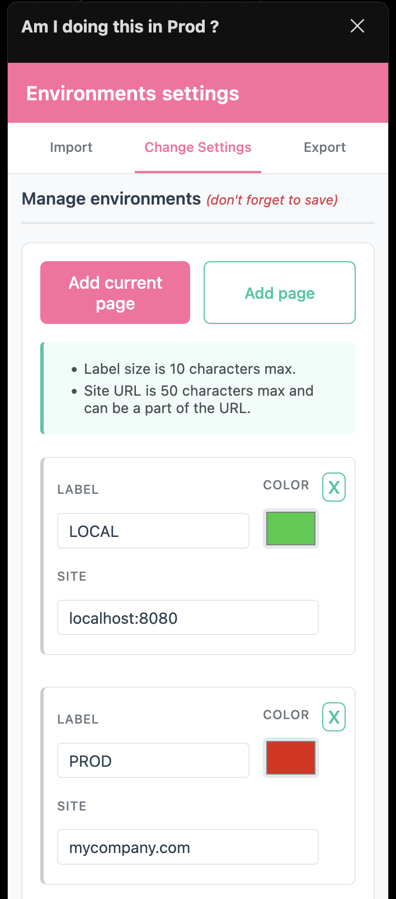
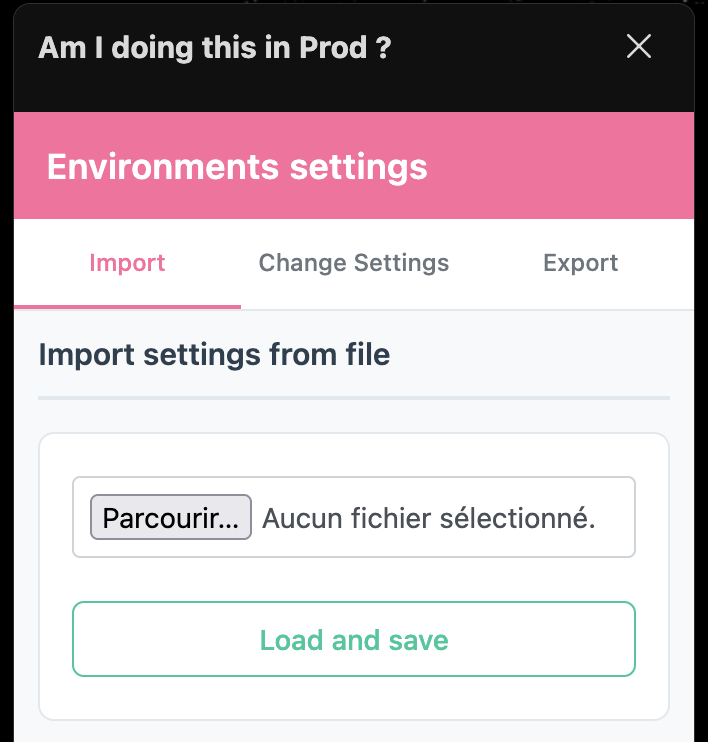
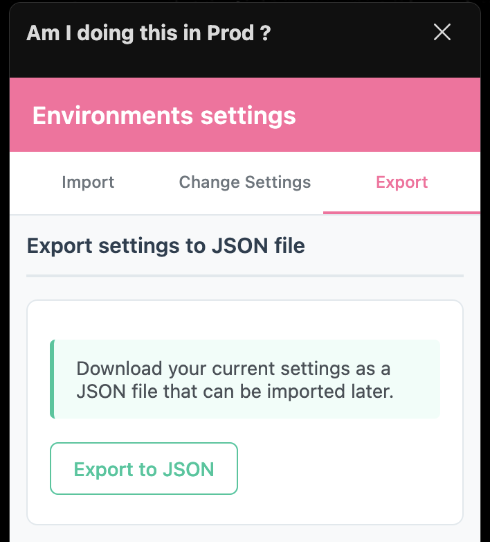

# Am I doing this in Prod ?

Have you ever come close to create a silly product on production while thinking you were on your testing tab ?

This extension display a ribbon on specific pages in order to have a quick view of which environment you're in !


Download in `Chrome web store` : [Am I doing this in Prod ?](https://chrome.google.com/webstore/detail/am-i-doing-this-in-prod/aoglejgecidnodkkogbgieidhmhjjnch) 

Download for `Firefox` _(not 100% supported yet, see below)_ : [Am I doing this in Prod ? (experimental)](https://addons.mozilla.org/en-CA/firefox/addon/am-i-doing-this-in-prod/)


---

## What does it do

This extension allows to :

* Add an env from a specific page and customize the : 
    * URL,
    * Ribbon's background color
    * Label (max 10 characters)
* Add a default env and customize it
* Export your configuration in JSON format (to share with your team, maybe)
* Import a configuration 

## Getting Started

The settings page is accessible from the plugin options or by clicking on the plugin's icon on your
plugins' menu (the left one on the screenshot below)


Once you have installed the extension you can start to add pages/environment or import existing settings





You can also export settings



### Customize/Add an environment

Once you're on the settings' page (see "Getting started")  you can click on "Add current" or "Add page"

You can cut parts of the url as the extension only checks if the page's url contains the url specified.

For example,
> `testing.myapp` will work for `www.backend.testing.myapp.fr`

Don't forget to hit the save button !


### Export Settings

You'll get a json file with your settings.

### Import Settings

Usually you'll get an file to import by previously exporting settings.


If you need to know the structure, it may look like this :

```
[
    {
        "site": "myurl.fr",
        "label": "PROD",
        "color": "#7c6a6a"
    },
    {
        "site": "testing.myurl.fr",
        "label": "TESTING",
        "color": "#7585ff"
    }
]
```

---

## Built With

Vanilla JS only

---

## Authors

* **Flora Guy-Coichard** [GitHub](https://github.com/floragc-octo/)

with the participation of
* **Simon Belbeoch** [GitHub](https://github.com/LiquidITGuy)

---

## Versioning

Work in Progress

---

## License

This project is licensed under the MIT License - see the [LICENSE.md](LICENSE.md) file for details
